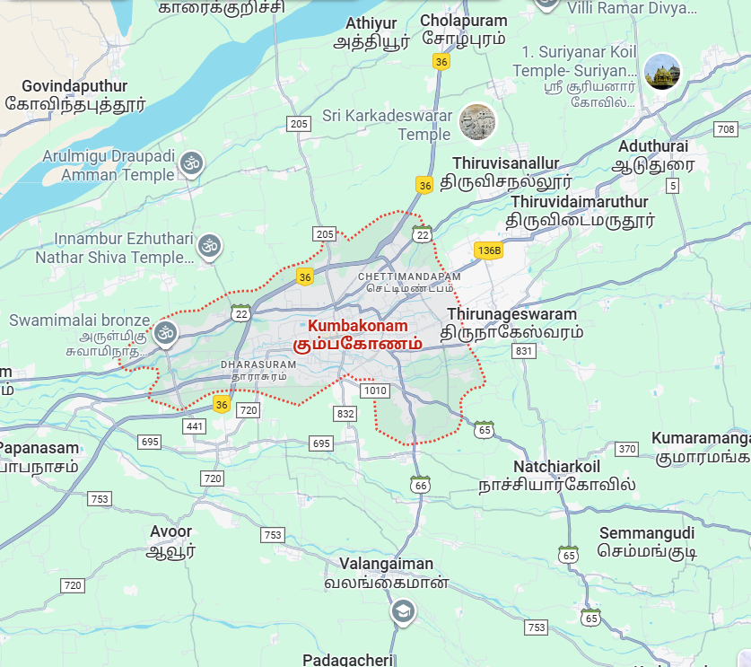

# Ex04 Places Around Me
## Date: 25/09/25

## AIM
To develop a website to display details about the places around my house.

## DESIGN STEPS

### STEP 1
Create a Django admin interface.

### STEP 2
Download your city map from Google.

### STEP 3
Using ```<map>``` tag name the map.

### STEP 4
Create clickable regions in the image using ```<area>``` tag.

### STEP 5
Write HTML programs for all the regions identified.

### STEP 6
Execute the programs and publish them.

## CODE
```
map.html
<html>

<head>

<title>My City</title>

</head>

<body>

<h1 align="center">

<font color="red"><b>kumbakonam</b></font>

</h1>

<h3 align="center">

<font color="blue"><b> pragadeesh (25018154)</b></font>

</h3>

<center>



<map name="MyCity">


<map name="image-map">
    <area shape="rect" coords="700,250,850,400" href="home.html" title="my home town" 
    <area target="_blank" alt="avoor" title="avoor" href="avoor.html " coords="79,674,273,530" shape="rect">
    <area target="_blank" alt="valangai" title="valangai" href="valangai.html" coords="457,643,94" shape="circle">
    <area target="_blank" alt="kmk" title="kmk" href="kmk.html" coords="252,281,524,435" shape="rect">
    <area target="_blank" alt="aduthurai" title="aduthurai" href="aduthurai.html" coords="712,127,128" shape="circle">

</map>
</center>
</body>
</html>

home.html 
<!DOCTYPE html>
<html>
<head>
    <title>My Home Town</title>
</head>
<body bgcolor="cyan">
    <h1 align="center">
        <font color="red"><b>kumbakonam</b></font>
    </h1>

    <h3 align="center">
        <font color="blue"><b>kumbakonam - My Home Town</b></font>
    </h3>

    <hr size="3" color="red">

    <p align="justify">
        <font face="Georgia" size="5">
            Kumbakonam is a city in the Thanjavur district of Tamil Nadu, India, known for its rich cultural heritage and historic temples. It's situated 40 kilometers from Thanjavur and 282 kilometers from Chennai, bounded by the Kaveri River to the north and Arasalar River to the south. This temple town is famous for its Mahamaham festival, celebrated every 12 years, attracting millions of pilgrims.

Key Features:

- Temples: Kumbakonam boasts numerous temples, including Adi Kumbeshwara Temple, Sarangapani Temple, Nageswaran Temple, and Airavatesvara Temple, a UNESCO World Heritage Site.
- Festivals: The Mahamaham festival is a major event, and other festivals like Shivratri, Annabhishekam, and Thiruvadhirai are also celebrated.
- Economy: The city's economy is driven by agriculture, with rice production being a significant activity. It's also known for its metalwork, silk weaving, and handicrafts.
- Education: Kumbakonam has a rich educational heritage, with institutions like Government Arts College, established in 1867, and Shanmugha Arts, Science, Technology & Research Academy.


        </font>
    </p>
</body>
</html>

aduthurai.html
<!DOCTYPE html>
<html>
<head>
    <title>My Home Town</title>
</head>
<body bgcolor="cyan">
    <h1 align="center">
        <font color="red"><b>aduthurai</b></font>
    </h1>

    <h3 align="center">
        <font color="blue"><b>aduthurai - game grounds</b></font>
    </h3>

    <hr size="3" color="red">

    <p align="justify">
        <font face="Georgia" size="5">
         Aduthurai is a town in the Thanjavur district of Tamil Nadu, India, and it's closely related to Kumbakonam. Here's what I found ¹:
- Location: Aduthurai is situated near Kumbakonam, a city known for its rich cultural heritage and historic temples.
- Significance: While specific details about Aduthurai aren't readily available, its proximity to Kumbakonam suggests it might share some cultural and historical significance with the region   
        </font>
    </p>
</body>
</html>
 
 valangai.html

 <!DOCTYPE html>
<html>
<head>
    <title>My Home Town</title>
</head>
<body bgcolor="cyan">
    <h1 align="center">
        <font color="red"><b>valangai</b></font>
    </h1>

    <h3 align="center">
        <font color="blue"><b>valangai - crackers spot </b></font>
    </h3>

    <hr size="3" color="red">

    <p align="justify">
        <font face="Georgia" size="5">
            valangaiman is a town panchayat located about 10 kilometers south of Kumbakonam in the Thiruvarur district of Tamil Nadu, India. It's known for the famous Sri Vembadi Seethaladevi Mariamman Temple, a significant Hindu shrine dedicated to Goddess Mariamman.


        </font>
    </p>
</body>
</html>
~~~


## OUTPUT


## RESULT 
The program for implementing image maps using HTML is executed successfully.
